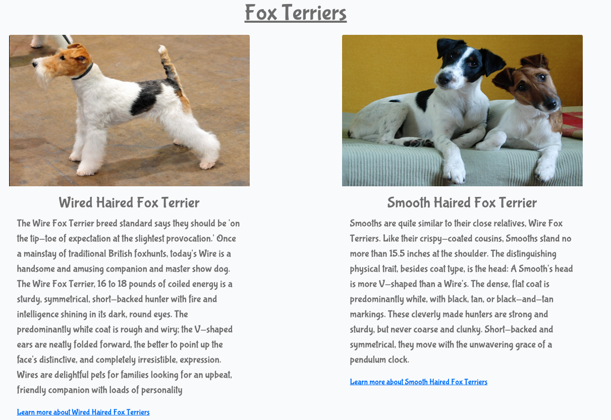

# Fox Terrier Owners Club

The Fox Terrier Owners Club site was designed to raise awareness of how amazing Fox Terriers are and to help anyone that would like to adopt one or even rehome a Fox Terrier. The app is designed towards users who love fox terriers, would just like to know abit more about them or would indeed like to own one through our adoption process. Plus if life has changed to a point where it is not possible to offer the life style you want for your Fox Terrier anymore, we have a rehoming process that can be used to ensure every Fox Terrier has a amazing life.

Here a link to my project - [Fox Terriers Owners Club](https://pimmz-project-4-9cc2ab59cc64.herokuapp.com/)

<https://ui.dev/amiresponsive?url=https://pimmz-project-4-9cc2ab59cc64.herokuapp.com>


## UX
When I started the design of the Fox Terrier Owners Club I wanted to ensure the site was Useful, Useable and Valuable so that it makes the user experience informative and enjoyable. To do this I looked at the five key fundamentals;

Strategy - So the user can discover, Learn, enjoy, interact and get assistance with all things to do with Fox Terriers. 

Scope - Based on the information from the strategy, the features included emotive images and giphs to show the nature of Fox Terriers. A about section that goes through the basic characters of both types of Fox Terrier and a more indepth look via wikipedia. The Post Room that enables the user to post a picture of there dog or comment on another persons. The adoption facility was set up becasue so many dogs unfortunatley dont get the start in life they deserve, so to have a loving family adopt one of those dogs is amazing. Plus if life has changed to a point where it is not possible to offer the life style you want for your Fox Terrier anymore, we have a rehoming process that can be used to ensure every Fox Terrier has a amazing life.

Structure - This was designed around the user. After speaking with a number of fox terrier owners, they wanted to know more about Fox Terriers. To be able to interact with other owners, to have the possibility to adopt a fox terrier and of course rehome one if life had unfortunatley changed for them so that they could no lomger look after one.

Skeleton - As before this was designed around the user which was gained from information supplied by a number of Fox Terrier Owners. This dictated that it would be laid out simply. So that it can be used quickly and efficiently while delivering the most amount of information and receiving help depending on the users needs.

Surface - I wanted the look of the Fox Terrier Owners Club to be informative, clear, and concise, with consistent typography and corresponding colours to help them stand out, to easily navigate with emotive pictures that helped to bring an element of fun which I believe we all need on a daily basis.

Then I sat down and roughly sketched out onto paper what the screens would look like on a mobile, tablet and desktop, This then gave me the basis to start creating Famous Quote Matcher in Codeanywhere.


### Colour Scheme

The colour scheme of the site is mainly creams and browns. The colours chosen were chosen to specifically to match a Fox Terriers coat or near to it.

Great care was taken to establish a good contrast between background colours and text at all times to ensure maximum user accessibility.


A link to the colors used - [colorspace colors](<https://mycolor.space/gradient?ori=to+right+bottom&hex=%23FFEACE&hex2=%234F4537&sub=1>)

### Typography

I looked for fonts on Google Fonts, to help me decide as it gave a better visual aid for me to see how they all looked in their different weights. After many hours trying the fonts out on my game, I decided to use Bubblegum Sans all the way through to ensure a good balance, with a consistent look and feel. As a backup, I used sans-serif as it has a great look and then my third choice was serif as a fallback in case the other two weren't available.

- [bubblegum sans](https://fonts.google.com/specimen/Bubblegum+Sans?query=bubble) was used for all the text and headers.

- [Sans serif](https://fonts.google.com/knowledge/glossary/sans_serif) was used for the back up font.

## Icons

To help with making Fox Terrier Owners club as user-friendly as possible I used icons from font awesome. This helped highlight specific areas to bring the user's attention to it.

- [Font Awesome](https://fontawesome.com) icons were used in the title.

### User Stories

#### EPIC | User Profile

- As a Site User I can register an account so that I can add/edit/delete my adoption plus rehoming request and comment on the posts of other people's post.
- As a Site User, I can log in or log out of my account so that I can keep my account secure.
- As a Site User I can see my login status so that I know if I'm logged in or out.

#### EPIC | User Navigation

- As a Site User I can immediately understand the purpose of the site so that I can decide if it meets my needs.
- As a Site User, I can intuitively navigate around the site so that I can find content and understand where I am on the site.
- As a Site User, I can view a paginated list of posts so that I can easily select a post to view.
- As a Site User, I can click on a post so that I can read the full text
- As a Site User I can register an account so that I can comment, like, add a adoption and rehome request
- As a Site User, I can view a list of posts so that I can select one to read


#### EPIC | Post Management

- As a Site User, I can update and delete posts that I have created so that I can easily make changes without having to start over.
- As a Site User I can leave comments on a post so that I can be involved in the conversation
- As a Site User I can view my posts so that I can see and manage all my own posts, but not be able to change other peoples.
- As a Site User I can view my posts so I can find them easily in the one location.
- As a Site user I can like or unlike a post so that I can interact with the content


#### EPIC | Adoption Interaction

- As a Site User, I can see my request so that I can find it easily at a later date.
- As a Site User, I can update and delete adoption requests that I have created so that I can easily make changes if I have made a mistake.

#### EPIC | Rehome Interaction

- As a Site User, I can see my request so that I can find it easily at a later date.
- As a Site User, I can update and delete rehome requests that I have created so that I can easily make changes if I have made a mistake.

#### EPIC | Site Administration

- As a Site Administrator, I can create, read, update and delete adoption, rehome requests, posts and comments so that I can manage the app content.
- As a Site Administrator,I can view comments on an individual post so that I can read the conversation
- As a Site Admin I can create draft posts so that I can finish writing the content later

## Wireframes

<details>

 <summary>Home Page</summary>


</details>

<details>

<summary>About Page</summary>


</details>

<details>

<summary>Adoption Form</summary>


</details>

<details>

<summary>Rehome Form</summary>


</details>

<details>

<summary>Signed in user adoption details</summary>


</details>

<details>

<summary>Signed in user rehome  details</summary>


</details>

I've used [Balsamiq](https://balsamiq.com/wireframes) to design my site wireframes.


## Features

### Existing Features

- **Header**
  

  - A animated Fox Terrier logo was sourced from giphy.com to give the site a sense of fun, to help show the true nature of Fox terriers.
  - Title of the website to ensure users know exactly whre they are.
  - A simplfied menu of Home, About, Register and login available to everyone. This changes when the user registers or logs in.

- **Navigation Bar**
  

  - The navigation bar is present at the top of every page and includes all links to the various other pages.
  - New menus open up when the user is logged in, to display Adoption, Rehome, Post Room, The signed in users name "Welcome Steve" which drops down to show the   
    adoption or rehome requests they have made. Plus it includes the logout facility.

- **Footer**
  

  - The location of the Fox Terriers Owners club so users are aware, where its located in the world.
  - The footer section includes links to Facebook, Instagram, Twitter and Youtube.
  - Clicking the links in the footer opens a separate browser tab to avoid pulling the user away from the site.

- **Home Page**
  

  - Decription of our website and what were about so users can decide if its for them.
  - Fontawesome icons used to help draw the eye to the three key sections.
  - Three key sections enlarged to show the additional added features of the website.
  - Two images clearly showing the different types of Fox Terrier.  
  
- **About Page**
  

  - Clear title explaining the section
  - Two images clearly showing the different types of Fox Terrier.
  - A in depth look at the background of the two types of Fox Terriers.
  - To provide even more of a detailed look into Fox Terriers, a wikipedia link is available if the user wants to know more.
  
- **Adoption Page**
  

  - With a scary statistic that only 10% of dogs born will find a permanent home. Our aim is to find owners for our amazing dogs.
  - Specific questions targeted to potiental adoptees to greater under more about them.
  - Submit button to send the application form onwards
  - Cancel button to redirect the user back if they have changed their mind.
  - Confirmation message that the form has been succesfully submitted.
  
  - You are then taken to Adoption detail page

- **Adoption Details Page**
  

  - Details of the form you have just filled in are presented on the screen so the user can ensure they are correct.
  - Update button to allow the user to change any of the information they have just put in.
  - Delete button to allow the user to delete the adoption form they have just filled in, if they change their mind.
  - Cancel button to redirect the user back if they have changed their mind.

- **Adoption Update Page**
  

  - The facility to update the specific questions targeted in the original adoption form
  - Submit button to send the application form onwards
  - Cancel button to redirect the user back if they have changed their mind.
  - Confirmation message that the form has been succesfully submitted.
  

- **Adoption Delete Page**
  

  - This page give the user the opportunity to change their mind and delete their request.
  - Bright red button to highlight the danger of the task
  - Emotive animated fox terrier from giphy.com to ensure they doing the right thing.
  - Cancel button to redirect the user back if they have changed their mind.
  - Confirmation message that the form has been succesfully submitted.
  

- **Rehome Page**
  

  - With a worrying 73% rise in dogs being abandoned in the UK. We offer the opportunity to rehome any Fox Terrier rather than it be left on the streets.
  - Specific questions targeted to owners looking to rehome their Fox Terrier
  - Submit button to send the application form onwards
  - Cancel button to redirect the user back if they have changed their mind
  - Confirmation message that the form has been succesfully submitted.
  

- **Rehome Details Page**
  

  - Details of the form you have just filled in are presented on the screen so the user can ensure they are correct.
  - Update button to allow the user to change any of the information they have just put in.
  - Delete button to allow the user to delete the adoption form they have just filled in, if they change their mind.
  - Cancel button to redirect the user back if they have changed their mind.
  
- **Rehome update Page**
  

  - The facility to update the specific questions targeted in the original rehome form
  - Submit button to send the application form onwards
  - Cancel button to redirect the user back if they have changed their mind.
  - Confirmation message that the form has been succesfully submitted.
  

- **Rehome deletion Page**
  

  - This page give the user the opportunity to change their mind and delete their request.
  - Bright red button to highlight the danger of the task.
  - Emotive animated fox terrier from giphy.com to ensure they doing the right thing.
  - Cancel button to redirect the user back if they have changed their mind.
  - Confirmation message that the form has been succesfully submitted.
  

- **Post Room**
  

  - Welcoming message and clear explaination as to what you can do.
  - Area for user to post. With title, content and image upload facility.
  - Button to submit the users post.
  - Confirmation message that the post has been succesfully submitted.
  
  - Posts go upto a total of six on the page and then automatically go the next page. Next button for the user to scroll through.
  
  
- **Post update Page**
  

  - The facility to update the specific questions targeted in the original post form
  - Submit button to send the application form onwards
  - Cancel button to redirect the user back if they have changed their mind.
  - Confirmation message that the form has been succesfully submitted.
  

- **Post deletion Page**
  

  - This page give the user the opportunity to change their mind and delete their request.
  - Bright red button to highlight the danger of the task.
  - Emotive animated fox terrier from giphy.com to ensure they doing the right thing.
  - Cancel button to redirect the user back if they have changed their mind.
  - Confirmation message that the form has been succesfully submitted.
  

- **Comment Room**
  

  - Picture and title of the selected post the user wishes to comment on.
  - The comment left by the user that posted.
  - The signed in users name, the date and time they posted it.
  - The options to like the post and unlike the post with a loveheart icon.
  - The amount of comments added about the post.
  - Comments left by other users including their name, the date and time they left it.
  - Submit button to send the comment onwards to be approved
  
  - Security function to only be able to delete the users own posts and no others
  


⚠️⚠️⚠️⚠️⚠️ START OF NOTES (to be deleted) ⚠️⚠️⚠️⚠️⚠️

Repeat as necessary for as many features as your site contains.

Hint: the more, the merrier!

🛑🛑🛑🛑🛑 END OF NOTES (to be deleted) 🛑🛑🛑🛑🛑

### Future Features

⚠️⚠️⚠️⚠️⚠️ START OF NOTES (to be deleted) ⚠️⚠️⚠️⚠️⚠️

Do you have additional ideas that you'd like to include on your project in the future?
Fantastic! List them here!
It's always great to have plans for future improvements!
Consider adding any helpful links or notes to help remind you in the future, if you revisit the project in a couple years.

🛑🛑🛑🛑🛑 END OF NOTES (to be deleted) 🛑🛑🛑🛑🛑

- Title for future feature #1
  - Any additional notes about this feature.
- Title for future feature #2
  - Any additional notes about this feature.
- Title for future feature #3
  - Any additional notes about this feature.

## Tools & Technologies Used

⚠️⚠️⚠️⚠️⚠️ START OF NOTES (to be deleted) ⚠️⚠️⚠️⚠️⚠️

In this section, you should explain the various tools and technologies used to develop the project.
Make sure to put a link (where applicable) to the source, and explain what each was used for.
Some examples have been provided, but this is just a sample only, your project might've used others.
Feel free to delete any unused items below as necessary.

🛑🛑🛑🛑🛑 END OF NOTES (to be deleted) 🛑🛑🛑🛑🛑

- [HTML](https://en.wikipedia.org/wiki/HTML) used for the main site content.
- [CSS](https://en.wikipedia.org/wiki/CSS) used for the main site design and layout.
- [CSS :root variables](https://www.w3schools.com/css/css3_variables.asp) used for reusable styles throughout the site.
- [CSS Flexbox](https://www.w3schools.com/css/css3_flexbox.asp) used for an enhanced responsive layout.
- [CSS Grid](https://www.w3schools.com/css/css_grid.asp) used for an enhanced responsive layout.
- [JavaScript](https://www.javascript.com) used for user interaction on the site.
- [Python](https://www.python.org) used as the back-end programming language.
- [Git](https://git-scm.com) used for version control. (`git add`, `git commit`, `git push`)
- [GitHub](https://github.com) used for secure online code storage.
- [GitHub Pages](https://pages.github.com) used for hosting the deployed front-end site.
- [Gitpod](https://gitpod.io) used as a cloud-based IDE for development.
- [Bootstrap](https://getbootstrap.com) used as the front-end CSS framework for modern responsiveness and pre-built components.
- [Materialize](https://materializecss.com) used as the front-end CSS framework for modern responsiveness and pre-built components.
- [Flask](https://flask.palletsprojects.com) used as the Python framework for the site.
- [Django](https://www.djangoproject.com) used as the Python framework for the site.
- [MongoDB](https://www.mongodb.com) used as the non-relational database management with Flask.
- [SQLAlchemy](https://www.sqlalchemy.org) used as the relational database management with Flask.
- [PostgreSQL](https://www.postgresql.org) used as the relational database management.
- [ElephantSQL](https://www.elephantsql.com) used as the Postgres database.
- [Heroku](https://www.heroku.com) used for hosting the deployed back-end site.
- [Cloudinary](https://cloudinary.com) used for online static file storage.
- [Stripe](https://stripe.com) used for online secure payments of ecommerce products/services.
- [AWS S3](https://aws.amazon.com/s3) used for online static file storage.

## Database Design

Entity Relationship Diagrams (ERD) help to visualize database architecture before creating models.
Understanding the relationships between different tables can save time later in the project.

⚠️⚠️⚠️⚠️⚠️ START OF NOTES (to be deleted) ⚠️⚠️⚠️⚠️⚠️

Using your defined models (one example below), create an ERD with the relationships identified.

🛑🛑🛑🛑🛑 END OF NOTES (to be deleted) 🛑🛑🛑🛑🛑

```python
class Product(models.Model):
    category = models.ForeignKey(
        "Category", null=True, blank=True, on_delete=models.SET_NULL)
    sku = models.CharField(max_length=254, null=True, blank=True)
    name = models.CharField(max_length=254)
    description = models.TextField()
    has_sizes = models.BooleanField(default=False, null=True, blank=True)
    price = models.DecimalField(max_digits=6, decimal_places=2)
    rating = models.DecimalField(
        max_digits=6, decimal_places=2, null=True, blank=True)
    image_url = models.URLField(max_length=1024, null=True, blank=True)
    image = models.ImageField(null=True, blank=True)

    def __str__(self):
        return self.name
```

⚠️⚠️⚠️⚠️⚠️ START OF NOTES (to be deleted) ⚠️⚠️⚠️⚠️⚠️

A couple recommendations for building free ERDs:

- [Draw.io](https://draw.io)
- [Lucidchart](https://www.lucidchart.com/pages/ER-diagram-symbols-and-meaning)

🛑🛑🛑🛑🛑 END OF NOTES (to be deleted) 🛑🛑🛑🛑🛑


⚠️⚠️⚠️⚠️⚠️ START OF NOTES (to be deleted) ⚠️⚠️⚠️⚠️⚠️

Using Markdown formatting to represent an example ERD table using the Product model above:

🛑🛑🛑🛑🛑 END OF NOTES (to be deleted) 🛑🛑🛑🛑🛑

- Table: **Product**

    | **PK** | **id** (unique) | Type | Notes |
    | --- | --- | --- | --- |
    | **FK** | category | ForeignKey | FK to **Category** model |
    | | sku | CharField | |
    | | name | CharField | |
    | | description | TextField | |
    | | has_sizes | BooleanField | |
    | | price | DecimalField | |
    | | rating | DecimalField | |
    | | image_url | URLField | |
    | | image | ImageField | |

## Agile Development Process

### GitHub Projects

[GitHub Projects](https://github.com/Pimmz/Project-4/projects) served as an Agile tool for this project.
It isn't a specialized tool, but with the right tags and project creation/issue assignments, it can be made to work.

Through it, user stories, issues, and milestone tasks were planned, then tracked on a weekly basis using the basic Kanban board.

⚠️⚠️⚠️⚠️⚠️ START OF NOTES (to be deleted) ⚠️⚠️⚠️⚠️⚠️

Consider adding a basic screenshot of your Projects Board.

🛑🛑🛑🛑🛑 END OF NOTES (to be deleted) 🛑🛑🛑🛑🛑


### GitHub Issues

[GitHub Issues](https://github.com/Pimmz/Project-4/issues) served as an another Agile tool.
There, I used my own **User Story Template** to manage user stories.

It also helped with milestone iterations on a weekly basis.

⚠️⚠️⚠️⚠️⚠️ START OF NOTES (to be deleted) ⚠️⚠️⚠️⚠️⚠️

Consider adding a screenshot of your Open and Closed Issues.

🛑🛑🛑🛑🛑 END OF NOTES (to be deleted) 🛑🛑🛑🛑🛑

- [Open Issues](https://github.com/Pimmz/Project-4/issues)

    

- [Closed Issues](https://github.com/Pimmz/Project-4/issues?q=is%3Aissue+is%3Aclosed)

    

### MoSCoW Prioritization

I've decomposed my Epics into stories prior to prioritizing and implementing them.
Using this approach, I was able to apply the MoSCow prioritization and labels to my user stories within the Issues tab.

- **Must Have**: guaranteed to be delivered (*max 60% of stories*)
- **Should Have**: adds significant value, but not vital (*the rest ~20% of stories*)
- **Could Have**: has small impact if left out (*20% of stories*)
- **Won't Have**: not a priority for this iteration

## Testing

For all testing, please refer to the [TESTING.md](TESTING.md) file.

## Deployment

⚠️⚠️⚠️⚠️⚠️ START OF NOTES (to be deleted) ⚠️⚠️⚠️⚠️⚠️

**IMPORTANT:**

- ⚠️ DO NOT update the environment variables to your own! These should NOT be included in this file; just demo values! ⚠️
- ⚠️ DO NOT update the environment variables to your own! These should NOT be included in this file; just demo values! ⚠️
- ⚠️ DO NOT update the environment variables to your own! These should NOT be included in this file; just demo values! ⚠️

🛑🛑🛑🛑🛑 END OF NOTES (to be deleted) 🛑🛑🛑🛑🛑

The live deployed application can be found deployed on [Heroku](https://pimmz-project-4-9cc2ab59cc64.herokuapp.com).

### ElephantSQL Database

This project uses [ElephantSQL](https://www.elephantsql.com) for the PostgreSQL Database.

To obtain your own Postgres Database, sign-up with your GitHub account, then follow these steps:

- Click **Create New Instance** to start a new database.
- Provide a name (this is commonly the name of the project: Project-4).
- Select the **Tiny Turtle (Free)** plan.
- You can leave the **Tags** blank.
- Select the **Region** and **Data Center** closest to you.
- Once created, click on the new database name, where you can view the database URL and Password.

### Cloudinary API

This project uses the [Cloudinary API](https://cloudinary.com) to store media assets online, due to the fact that Heroku doesn't persist this type of data.

To obtain your own Cloudinary API key, create an account and log in.

- For *Primary interest*, you can choose *Programmable Media for image and video API*.
- Optional: *edit your assigned cloud name to something more memorable*.
- On your Cloudinary Dashboard, you can copy your **API Environment Variable**.
- Be sure to remove the `CLOUDINARY_URL=` as part of the API **value**; this is the **key**.

### Heroku Deployment

This project uses [Heroku](https://www.heroku.com), a platform as a service (PaaS) that enables developers to build, run, and operate applications entirely in the cloud.

Deployment steps are as follows, after account setup:

- Select **New** in the top-right corner of your Heroku Dashboard, and select **Create new app** from the dropdown menu.
- Your app name must be unique, and then choose a region closest to you (EU or USA), and finally, select **Create App**.
- From the new app **Settings**, click **Reveal Config Vars**, and set your environment variables.

| Key | Value |
| --- | --- |
| `CLOUDINARY_URL` | user's own value |
| `DATABASE_URL` | user's own value |
| `DISABLE_COLLECTSTATIC` | 1 (*this is temporary, and can be removed for the final deployment*) |
| `SECRET_KEY` | user's own value |

Heroku needs two additional files in order to deploy properly.

- requirements.txt
- Procfile

You can install this project's **requirements** (where applicable) using:

- `pip3 install -r requirements.txt`

If you have your own packages that have been installed, then the requirements file needs updated using:

- `pip3 freeze --local > requirements.txt`

The **Procfile** can be created with the following command:

- `echo web: gunicorn app_name.wsgi > Procfile`
- *replace **app_name** with the name of your primary Django app name; the folder where settings.py is located*

For Heroku deployment, follow these steps to connect your own GitHub repository to the newly created app:

Either:

- Select **Automatic Deployment** from the Heroku app.

Or:

- In the Terminal/CLI, connect to Heroku using this command: `heroku login -i`
- Set the remote for Heroku: `heroku git:remote -a app_name` (replace *app_name* with your app name)
- After performing the standard Git `add`, `commit`, and `push` to GitHub, you can now type:
  - `git push heroku main`

The project should now be connected and deployed to Heroku!

### Local Deployment

This project can be cloned or forked in order to make a local copy on your own system.

For either method, you will need to install any applicable packages found within the *requirements.txt* file.

- `pip3 install -r requirements.txt`.

You will need to create a new file called `env.py` at the root-level,
and include the same environment variables listed above from the Heroku deployment steps.

Sample `env.py` file:

```python
import os

os.environ.setdefault("CLOUDINARY_URL", "user's own value")
os.environ.setdefault("DATABASE_URL", "user's own value")
os.environ.setdefault("SECRET_KEY", "user's own value")

# local environment only (do not include these in production/deployment!)
os.environ.setdefault("DEBUG", "True")
```

Once the project is cloned or forked, in order to run it locally, you'll need to follow these steps:

- Start the Django app: `python3 manage.py runserver`
- Stop the app once it's loaded: `CTRL+C` or `⌘+C` (Mac)
- Make any necessary migrations: `python3 manage.py makemigrations`
- Migrate the data to the database: `python3 manage.py migrate`
- Create a superuser: `python3 manage.py createsuperuser`
- Load fixtures (if applicable): `python3 manage.py loaddata file-name.json` (repeat for each file)
- Everything should be ready now, so run the Django app again: `python3 manage.py runserver`

#### Cloning

You can clone the repository by following these steps:

1. Go to the [GitHub repository](https://github.com/Pimmz/Project-4)
2. Locate the Code button above the list of files and click it
3. Select if you prefer to clone using HTTPS, SSH, or GitHub CLI and click the copy button to copy the URL to your clipboard
4. Open Git Bash or Terminal
5. Change the current working directory to the one where you want the cloned directory
6. In your IDE Terminal, type the following command to clone my repository:
	- `git clone https://github.com/Pimmz/Project-4.git`
7. Press Enter to create your local clone.

Alternatively, if using Gitpod, you can click below to create your own workspace using this repository.

[](https://gitpod.io/#https://github.com/Pimmz/Project-4)

Please note that in order to directly open the project in Gitpod, you need to have the browser extension installed.
A tutorial on how to do that can be found [here](https://www.gitpod.io/docs/configure/user-settings/browser-extension).

#### Forking

By forking the GitHub Repository, we make a copy of the original repository on our GitHub account to view and/or make changes without affecting the original owner's repository.
You can fork this repository by using the following steps:

1. Log in to GitHub and locate the [GitHub Repository](https://github.com/Pimmz/Project-4)
2. At the top of the Repository (not top of page) just above the "Settings" Button on the menu, locate the "Fork" Button.
3. Once clicked, you should now have a copy of the original repository in your own GitHub account!

### Local VS Deployment

⚠️⚠️⚠️⚠️⚠️ START OF NOTES (to be deleted) ⚠️⚠️⚠️⚠️⚠️

Use this space to discuss any differences between the local version you've developed, and the live deployment site on Heroku.

🛑🛑🛑🛑🛑 END OF NOTES (to be deleted) 🛑🛑🛑🛑🛑

## Credits

⚠️⚠️⚠️⚠️⚠️ START OF NOTES (to be deleted) ⚠️⚠️⚠️⚠️⚠️

In this section you need to reference where you got your content, media, and extra help from.
It is common practice to use code from other repositories and tutorials,
however, it is important to be very specific about these sources to avoid plagiarism.

🛑🛑🛑🛑🛑 END OF NOTES (to be deleted) 🛑🛑🛑🛑🛑

### Content

⚠️⚠️⚠️⚠️⚠️ START OF NOTES (to be deleted) ⚠️⚠️⚠️⚠️⚠️

Use this space to provide attribution links to any borrowed code snippets, elements, or resources.
A few examples have been provided below to give you some ideas.

Ideally, you should provide an actual link to every resource used, not just a generic link to the main site!

🛑🛑🛑🛑🛑 END OF NOTES (to be deleted) 🛑🛑🛑🛑🛑

| Source | Location | Notes |
| --- | --- | --- |
| [Markdown Builder](https://traveltimn.github.io/markdown-builder) | README and TESTING | tool to help generate the Markdown files |
| [Chris Beams](https://chris.beams.io/posts/git-commit) | version control | "How to Write a Git Commit Message" |
| [W3Schools](https://www.w3schools.com/howto/howto_js_topnav_responsive.asp) | entire site | responsive HTML/CSS/JS navbar |
| [W3Schools](https://www.w3schools.com/howto/howto_css_modals.asp) | contact page | interactive pop-up (modal) |
| [W3Schools](https://www.w3schools.com/css/css3_variables.asp) | entire site | how to use CSS :root variables |
| [Flexbox Froggy](https://flexboxfroggy.com/) | entire site | modern responsive layouts |
| [Grid Garden](https://cssgridgarden.com) | entire site | modern responsive layouts |
| [StackOverflow](https://stackoverflow.com/a/2450976) | quiz page | Fisher-Yates/Knuth shuffle in JS |
| [YouTube](https://www.youtube.com/watch?v=YL1F4dCUlLc) | leaderboard | using `localStorage()` in JS for high scores |
| [YouTube](https://www.youtube.com/watch?v=u51Zjlnui4Y) | PP3 terminal | tutorial for adding color to the Python terminal |
| [strftime](https://strftime.org) | CRUD functionality | helpful tool to format date/time from string |
| [WhiteNoise](http://whitenoise.evans.io) | entire site | hosting static files on Heroku temporarily |

### Media

⚠️⚠️⚠️⚠️⚠️ START OF NOTES (to be deleted) ⚠️⚠️⚠️⚠️⚠️

Use this space to provide attribution links to any images, videos, or audio files borrowed from online.
A few examples have been provided below to give you some ideas.

If you're the owner (or a close acquaintance) of all media files, then make sure to specify this.
Let the assessors know that you have explicit rights to use the media files within your project.

Ideally, you should provide an actual link to every media file used, not just a generic link to the main site!
The list below is by no means exhaustive. Within the Code Institute Slack community, you can find more "free media" links
by sending yourself the following command: `!freemedia`.

🛑🛑🛑🛑🛑 END OF NOTES (to be deleted) 🛑🛑🛑🛑🛑

| Source | Location | Type | Notes |
| --- | --- | --- | --- |
| [Pexels](https://www.pexels.com) | entire site | image | favicon on all pages |
| [Lorem Picsum](https://picsum.photos) | home page | image | hero image background |
| [Unsplash](https://unsplash.com) | product page | image | sample of fake products |
| [Pixabay](https://pixabay.com) | gallery page | image | group of photos for gallery |
| [Wallhere](https://wallhere.com) | footer | image | background wallpaper image in the footer |
| [This Person Does Not Exist](https://thispersondoesnotexist.com) | testimonials | image | headshots of fake testimonial images |
| [Audio Micro](https://www.audiomicro.com/free-sound-effects) | game page | audio | free audio files to generate the game sounds |
| [Videvo](https://www.videvo.net/) | home page | video | background video on the hero section |
| [TinyPNG](https://tinypng.com) | entire site | image | tool for image compression |

### Acknowledgements

⚠️⚠️⚠️⚠️⚠️ START OF NOTES (to be deleted) ⚠️⚠️⚠️⚠️⚠️

Use this space to provide attribution to any supports that helped, encouraged, or supported you throughout the development stages of this project.
A few examples have been provided below to give you some ideas.

🛑🛑🛑🛑🛑 END OF NOTES (to be deleted) 🛑🛑🛑🛑🛑

- I would like to thank my Code Institute mentor, [Tim Nelson](https://github.com/TravelTimN) for their support throughout the development of this project.
- I would like to thank the [Code Institute](https://codeinstitute.net) tutor team for their assistance with troubleshooting and debugging some project issues.
- I would like to thank the [Code Institute Slack community](https://code-institute-room.slack.com) for the moral support; it kept me going during periods of self doubt and imposter syndrome.
- I would like to thank my partner (John/Jane), for believing in me, and allowing me to make this transition into software development.
- I would like to thank my employer, for supporting me in my career development change towards becoming a software developer.
