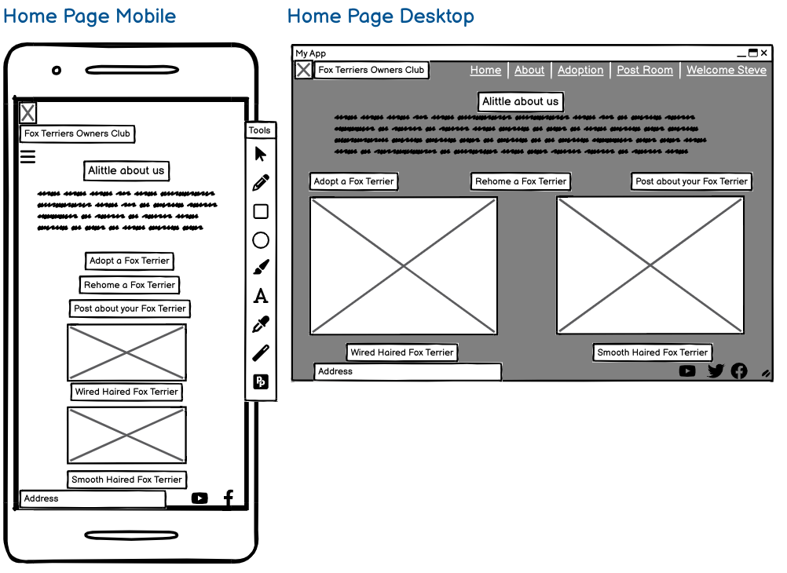
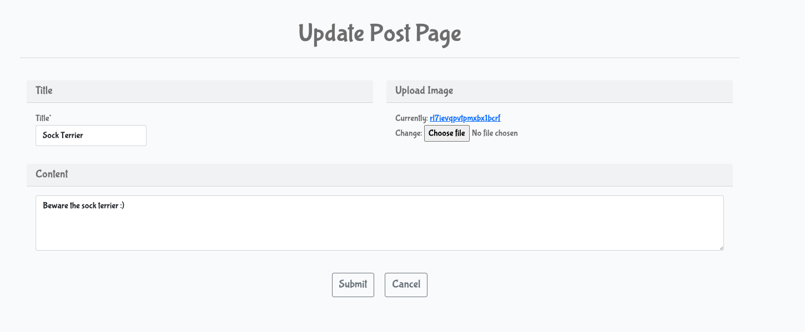

# Fox Terrier Owners Club

The Fox Terrier Owners Club site was designed to raise awareness of how amazing Fox Terriers are and to help anyone who would like to adopt one or even rehome a Fox Terrier. The app is designed towards users who love fox terriers, would just like to know a bit more about them or would indeed like to own one through our adoption process. Plus if life has changed to a point where it is not possible to offer the lifestyle you want for your Fox Terrier anymore, we have a rehoming process that can be used to ensure every Fox Terrier has an amazing life.

Here is a link to my project - [Fox Terriers Owners Club](https://pimmz-project-4-9cc2ab59cc64.herokuapp.com/)


## Table of Contents

- [Fox Terrier Owners Club](#fox-terrier-owners-club)
  - [Table of Contents](#table-of-contents)
  - [User Experience (UX)](#user-experience-ux)
    - [User Stories](#user-stories)
      - [EPIC | User Profile](#epic--user-profile)
      - [EPIC | User Navigation](#epic--user-navigation)
      - [EPIC | Post Management](#epic--post-management)
      - [EPIC | Adoption Interaction](#epic--adoption-interaction)
      - [EPIC | Rehome Interaction](#epic--rehome-interaction)
      - [EPIC | Site Administration](#epic--site-administration)
    - [Colour Scheme](#colour-scheme)
    - [Typography](#typography)
  - [Icons](#icons)
  - [Wireframes](#wireframes)
  - [Features](#features)
    - [Existing Features](#existing-features)
    - [Error Pages](#error-pages)
    - [Future Features](#future-features)
  - [Tools and Technologies Used](#tools-and-technologies-used)
  - [Database Design](#database-design)
  - [Agile Development Process](#agile-development-process)
    - [GitHub Projects](#github-projects)
    - [GitHub Issues](#github-issues)
    - [MoSCoW Prioritization](#moscow-prioritization)
  - [Security Features and Defensive Design](#security-features-and-defensive-design)
    - [User Authentication](#user-authentication)
    - [Form Validation](#form-validation)
    - [Database Security](#database-security)
    - [Custom Error Pages](#custom-error-pages)
  - [Testing](#testing)
  - [Deployment](#deployment)
    - [ElephantSQL Database](#elephantsql-database)
    - [Cloudinary API](#cloudinary-api)
    - [Heroku Deployment](#heroku-deployment)
    - [Local Deployment](#local-deployment)
      - [Cloning](#cloning)
      - [Forking](#forking)
    - [Local VS Deployment](#local-vs-deployment)
  - [Credits](#credits)
    - [Content](#content)
    - [Media](#media)
    - [Acknowledgements](#acknowledgements)

## User Experience (UX)

When I started the design of the Fox Terrier Owners Club I wanted to ensure the site was Useful, Useable and Valuable so that it makes the user experience informative and enjoyable. To do this I looked at the five key fundamentals;

Strategy - So the user can discover, Learn, enjoy, interact and get assistance with all things to do with Fox Terriers.

Scope - Based on the information from the strategy, the features included emotive images and gifs to show the nature of Fox Terriers. An about section that goes through the basic characters of both types of Fox Terrier and a more in depth look via Wikipedia. The Post Room enables the user to post a picture of their dog or comment on another person. The adoption facility was set up because so many dogs, unfortunately, don't get the start in life they deserve, so to have a loving family adopt one of those dogs is amazing. Plus if life has changed to a point where it is not possible to offer the lifestyle you want for your Fox Terrier anymore, we have a rehoming process that can be used to ensure every Fox Terrier has an amazing life.

Structure - This was designed around the user. After speaking with a number of fox terrier owners, they wanted to know more about Fox Terriers. To be able to interact with other owners, to have the possibility to adopt a fox terrier and of course rehome one if life had unfortunately changed for them so that they could no longer look after one.

Skeleton - As before this was designed around the user which was gained from information supplied by a number of Fox Terrier Owners. This dictated that it would be laid out simply. So that it can be used quickly and efficiently while delivering the most amount of information and receiving help depending on the user's needs.

Surface - I wanted the look of the Fox Terrier Owners Club to be informative, clear, and concise, with consistent typography and corresponding colours to help them stand out, to easily navigate with emotive pictures that helped to bring an element of fun which I believe we all need on a daily basis.

Then I sat down and roughly sketched out onto paper what the screens would look like on a mobile, tablet and desktop, This then gave me the basis to start creating Famous Quote Matcher in Codeanywhere.
<details>

<summary>Rough Sketch</summary>


</details>

### User Stories

#### EPIC | User Profile

- As a Site User I can register an account so that I can add/edit/delete my adoption plus rehoming requests and comment on the posts of other people's post.
- As a Site User, I can log in or log out of my account so that I can keep my account secure.
- As a Site User I can see my login status so that I know if I'm logged in or out.

#### EPIC | User Navigation

- As a Site User I can immediately understand the purpose of the site so that I can decide if it meets my needs.
- As a Site User, I can intuitively navigate around the site so that I can find content and understand where I am on the site.
- As a Site User, I can view a paginated list of posts so that I can easily select a post to view.
- As a Site User, I can click on a post so that I can read the full text
- As a Site User I can register an account so that I can comment, like, add an adoption and rehome request
- As a Site User, I can view a list of posts so that I can select one to read

#### EPIC | Post Management

- As a Site User, I can update and delete posts that I have created so that I can easily make changes without having to start over.
- As a Site User I can leave comments on a post so that I can be involved in the conversation
- As a Site User I can view my posts so that I can see and manage all my own posts, but not be able to change other peoples.
- As a Site User I can view my posts so I can find them easily in one location.
- As a Site user I can like or unlike a post so that I can interact with the content

#### EPIC | Adoption Interaction

- As a Site User, I can see my request so that I can find it easily at a later date.
- As a Site User, I can update and delete adoption requests that I have created so that I can easily make changes if I have made a mistake.

#### EPIC | Rehome Interaction

- As a Site User, I can see my request so that I can find it easily at a later date.
- As a Site User, I can update and delete rehome requests that I have created so that I can easily make changes if I have made a mistake.

#### EPIC | Site Administration

- As a Site Administrator, I can create, read, update and delete adoption, rehome requests, posts and comments so that I can manage the app content.
- As a Site Administrator, I can view comments on an individual post so that I can read the conversation
- As a Site Admin I can create draft posts so that I can finish writing the content later

### Colour Scheme

The colour scheme of the site is mainly creams and browns. The colours chosen were chosen specifically to match a Fox Terriers coat or near to it.

Great care was taken to establish a good contrast between background colours and text at all times to ensure maximum user accessibility.


A link to the colors used - [colorspace colors](<https://mycolor.space/gradient?ori=to+right+bottom&hex=%23FFEACE&hex2=%234F4537&sub=1>)

### Typography

I looked for fonts on Google Fonts, to help me decide as it gave a better visual aid for me to see how they all looked in their different weights. After many hours trying the fonts out on my game, I decided to use Bubblegum Sans all the way through to ensure a good balance, with a consistent look and feel. As a backup, I used sans-serif as it has a great look and then my third choice was serif as a fallback in case the other two weren't available.

- [bubblegum sans](https://fonts.google.com/specimen/Bubblegum+Sans?query=bubble) was used for all the text and headers.

- [Sans serif](https://fonts.google.com/knowledge/glossary/sans_serif) was used for the backup font.

## Icons

To help make Fox Terrier Owners Club as user-friendly as possible I used icons from font awesome. This helped highlight specific areas to bring the user's attention to it.

- [Font Awesome](https://fontawesome.com) icons were used in the title.

## Wireframes

<details>

<summary>Home Page</summary>


</details>

<details>

<summary>About Page</summary>


</details>

<details>

<summary>Adoption Form</summary>


</details>

<details>

<summary>Rehome Form</summary>


</details>

<details>

<summary>Signed in user adoption details</summary>


</details>

<details>

<summary>Signed in user rehome details</summary>


</details>

I've used [Balsamiq](https://balsamiq.com/wireframes) to design my site wireframes.

## Features

### Existing Features

- **Header**


- An animated Fox Terrier logo was sourced from giphy.com to give the site a sense of fun, and to help show the true nature of Fox terriers.
- Title of the website to ensure users know exactly where they are.
- A simplified menu of Home, About, Register and Login available to everyone. This changes when the user registers or logs in.

- **Navigation Bar**


- The navigation bar is present at the top of every page and includes all links to the various other pages.
- New menus open up when the user is logged in, to display Adoption, Rehome, Post Room, The signed-in user's name "Welcome Steve" which drops down to show the
  adoption or rehome requests they have made. Plus it includes the logout facility.

- **Footer**


- The location of the Fox Terriers Owners Club so users are aware, of where it is located in the world.
- The footer section includes links to Facebook, Instagram, Twitter and YouTube.
- Clicking the links in the footer opens a separate browser tab to avoid pulling the user away from the site.

- **Home Page**


- Description of our website and what we're about so users can decide if it's for them.
- Fontawesome icons are used to help draw the eye to the three key sections.
- Three key sections enlarged to show the additional added features of the website.
- Two images clearly showing the different types of Fox Terrier.
- **About Page**


- Clear title explaining the section
- Two images clearly showing the different types of Fox Terrier.
- A in depth look at the background of the two types of Fox Terriers.
- To provide even more of a detailed look into Fox Terriers, a Wikipedia link is available if the user wants to know more.
- **Adoption Page**


- With a scary statistic that only 10% of dogs born will find a permanent home. Our aim is to find owners for our amazing dogs.
- Specific questions targeted to potential adoptees to greater under more about them.
- Error message if the user doesn't fill in the required text

- Submit button to send the application form onwards
- Cancel button to redirect the user back if they have changed their mind.
- Confirmation message that the form has been successfully submitted.

- You are then taken to the Adoption detail page

- **Adoption Details Page**


- Details of the form you have just filled in are presented on the screen so the user can ensure they are correct.
- Update button to allow the user to change any of the information they have just put in.
- Delete button to allow the user to delete the adoption form they have just filled in if they change their mind.
- Cancel button to redirect the user if they have changed their mind.

- **No Adoption Details Page**


- When there aren't any rehoming requests a screen informs the user that there aren't any details at the moment.
- Cancel button to redirect the user back to the home page.

- **Adoption Update Page**


- The facility to update the specific questions targeted in the original adoption form
- Submit button to send the application form onwards
- Cancel button to redirect the user back if they have changed their mind.
- Confirmation message that the form has been successfully submitted.


- **Adoption Delete Page**


- This page gives the user the opportunity to change their mind and delete their request.
- Bright red button to highlight the danger of the task
- Emotive animated fox terrier from giphy.com to ensure they are doing the right thing.
- Cancel button to redirect the user back if they have changed their mind.
- Confirmation message that the form has been successfully submitted.


- **Rehome Page**


- With a worrying 73% rise in dogs being abandoned in the UK. We offer the opportunity to rehome any Fox Terrier rather than it be left on the streets.
- Specific questions targeted to owners looking to rehome their Fox Terrier
- Error message if the user doesn't fill in the required text

- Submit button to send the application form onwards
- Cancel button to redirect the user back if they have changed their mind
- Confirmation message that the form has been successfully submitted.


- **Rehome Details Page**


- Details of the form you have just filled in are presented on the screen so the user can ensure they are correct.
- Update button to allow the user to change any of the information they have just put in.
- Delete button to allow the user to delete the adoption form they have just filled in if they change their mind.
- Cancel button to redirect the user back if they have changed their mind.
- **No Rehome Details Page**


- When there aren't any rehoming requests a screen informs the user that there aren't any details at the moment.
- Cancel button to redirect the user back to the home page.
- **Rehome update Page**


- The facility to update the specific questions targeted in the original rehome form
- Submit button to send the application form onwards
- Cancel button to redirect the user back if they have changed their mind.
- Confirmation message that the form has been successfully submitted.


- **Rehome deletion Page**


- This page gives the user the opportunity to change their mind and delete their request.
- Bright red button to highlight the danger of the task.
- Emotive animated fox terrier from giphy.com to ensure they are doing the right thing.
- Cancel button to redirect the user back if they have changed their mind.
- Confirmation message that the form has been successfully submitted.


- **Post Room**


- Welcoming message and clear explanation as to what you can do.
- Area for users to post. With title, content and image upload facility.
- Button to submit the user's post.
- Confirmation message that the post has been successfully submitted.

- Posts go up to a total of six on the page and then automatically go to the next page. Next button for the user to scroll through.

- Security function to only be able to delete the user's own posts and no others

- **Post update Page**


- The facility to update the specific questions targeted in the original post form
- Submit button to send the application form onwards
- Cancel button to redirect the user back if they have changed their mind.
- Confirmation message that the form has been successfully submitted.


- **Post deletion Page**


- This page gives the user the opportunity to change their mind and delete their request.
- Bright red button to highlight the danger of the task.
- Emotive animated fox terrier from giphy.com to ensure they are doing the right thing.
- Cancel button to redirect the user back if they have changed their mind.
- Confirmation message that the form has been successfully submitted.


- **Comment Room**


- Picture and title of the selected post the user wishes to comment on.
- The comment left by the user that posted.
- The signed-in user's name, the date and time they posted it.
- The options to like the post and unlike the post with a love heart icon.
- The number of comments added about the post.
- Comments left by other users including their name, the date and time they left it.
- Submit button to send the comment onwards to be approved


### Error Pages

Custom Error Pages were created to give the user more information on the error and to guide them back to the site.


- 400 Bad Request - The Easy Eater is unable to handle this request.
- 403 Page Forbidden - Looks like you're trying to access forbidden content. Please log out and sign in to the correct account.
- 404 Page Not Found - The page you're looking for doesn't exist.
- 500 Server Error - The Easy Eater is currently unable to handle this request

### Future Features

The following user stories were scoped out of the project due to time constraints and labelled as "Nice to Have" on the project board in Github and put into the "No time to complete" column. It is intended that these user stories will be implemented at a later date.

- As a user, I can receive confirmation that my adoption or rehome request has been successful via an email sent to me.
- As a user, I can search and filter posts so that I can target posts I wish to view instead of scrolling through posts.

Other potential features include:

- Adding training techniques and videos from users to benefit the whole group.
- Having an Illness diagnoses page so the user can put in the symptoms and their diagnosis with a link to a vet to confirm and assist with the issue.

## Tools and Technologies Used

- [HTML](https://en.wikipedia.org/wiki/HTML) used for the main site content.
- [CSS](https://en.wikipedia.org/wiki/CSS) used for the main site design and layout.
- [CSS Flexbox](https://www.w3schools.com/css/css3_flexbox.asp) used for an enhanced responsive layout.
- [CSS Grid](https://www.w3schools.com/css/css_grid.asp) used for an enhanced responsive layout.
- [JavaScript](https://www.javascript.com) used for user interaction on the site.
- [Python](https://www.python.org) is used as the back-end programming language.
- [Git](https://git-scm.com) used for version control. (`git add`, `git commit`, `git push`)
- [GitHub](https://github.com) used for secure online code storage.
- [GitHub Pages](https://pages.github.com) used for hosting the deployed front-end site.
- [codeanywhere](https://app.codeanywhere.com/) used as a cloud-based IDE for development.
- [Bootstrap](https://getbootstrap.com) is used as the front-end CSS framework for modern responsiveness and pre-built components.
- [Django](https://www.djangoproject.com) used as the Python framework for the site.
- [Django-allauth](https://django-allauth.readthedocs.io/en/latest/installation.html): authentication library used to create the user accounts
- [ElephantSQL](https://www.elephantsql.com) used as the Postgres database.
- [Heroku](https://www.heroku.com) used for hosting the deployed back-end site.
- [Cloudinary](https://cloudinary.com) is used for online static file storage.
- [AWS S3](https://aws.amazon.com/s3) used for online static file storage.
- [Balsamiq](https://balsamiq.com/) - Used to generate Wireframe images.
- [Chrome Dev Tools](https://developer.chrome.com/docs/devtools/) - Used for overall development and tweaking, including testing responsiveness and performance.
- [Font Awesome](https://fontawesome.com/) - Used for icons in the information bar.
- [Google Fonts](https://fonts.google.com/) - Used to import and alter fonts on the page.
- [W3C](https://www.w3.org/) - Used for HTML & CSS Validation.
- [PEP8 Online](http://pep8online.com/) - used to validate all the Python code
- [Jshint](https://jshint.com/) - used to validate javascript
- [Coolors](https://coolors.co/) - Used to create colour palette.
- [Favicon](https://favicon.io/) - Used to create the favicon.
- [Lucidchart](https://lucid.app/documents#/dashboard) - used to create the database schema design
- [Grammerly](https://app.grammarly.com/) - used to proofread the README.md
- [Summernote](https://summernote.org/): A WYSIWYG editor to allow users to edit their posts
- [Crispy Forms](https://django-crispy-forms.readthedocs.io/en/latest/) used to manage Django Forms

## Database Design

- I used principles of Object-Oriented Programming throughout this project and Django’s Class-Based Generic Views.
- Below is an example of the model I used for my adoption page

- 

- Using Markdown formatting to represent an ERD table the adoption model above would look like this:

- Table: **Adoption**

| Field | Type | Name | Notes |
| --- | --- | --- | --- |
| PK | ID | Autofield | |
| | terrier_type | CharField(10) | Which Fox terrier do you want to adopt? |
| | sex | CharField(10) | would prefer a Male or Female? |
| | age | CharField(200) | What age Fox Terrier, are you looking for?|
| | why | CharField(200) | Why would you like to adopt a Fox Terrier?|
| | experience | CharField(200) | What experience with dogs do you have? |
| | notes | CharField(200) | Additional notes or feedback? |
| | name | CharField(100) | Your Name? |
| | email | EmailField | Your Email? |
| FK | author | ForeignKey(User)| Author |
| | created_on | DateTimeField | Created_on |

- To help organise the remaining models required I used [Lucidchart](https://lucid.app/lucidchart/0a00742c-aa55-4964-8626-cff679e4ba5b/edit?viewport_loc=-448%2C20%2C3328%2C1572%2C0_0&invitationId=inv_85e6fc15-610f-42fe-b2bf-59e51136a95c)


## Agile Development Process

### GitHub Projects

[GitHub Projects](https://github.com/Pimmz/Project-4/projects) served as an Agile tool for this project.
It isn't a specialized tool, but with the right tags and project creation/issue assignments, it can be made to work.

Through it, user stories, issues, and milestone tasks were planned and then tracked using the basic Kanban board.


### GitHub Issues

[GitHub Issues](https://github.com/Pimmz/Project-4/issues) served as another Agile tool.
There, I used my own **User Story Template** to manage user stories.

It also helped with milestone iterations on a timely basis.

- [Open Issues](https://github.com/Pimmz/Project-4/issues)


- [Closed Issues](https://github.com/Pimmz/Project-4/issues?q=is%3Aissue+is%3Aclosed)


### MoSCoW Prioritization

I've decomposed my Epics into stories prior to prioritizing and implementing them.
Using this approach, I was able to apply the MoSCow prioritization and labels to my user stories within the Issues tab.

- **Must Have**: guaranteed to be delivered (*max 60% of stories*)
- **Should Have**: adds significant value, but not vital (*the rest ~20% of stories*)
- **Nice to Have**: has small impact if left out (*20% of stories*)
- **Won't Have**: not a priority for this iteration

## Security Features and Defensive Design

### User Authentication

- Django's @method_decorator is used to make sure that any requests to access secure pages by non-authenticated users are redirected to the signup page.
- Django's conditional statement  was also used to ensure certain pages were only accessible to logged-in users.

### Form Validation

- If incorrect or empty data is added to a form, the form won't submit and a warning will appear to the user informing them what field raised the error.

### Database Security

- The database URL and secret key are stored in the env.py file to prevent unwanted connections to the database and this was set up before the first push to
  Github.
- ERROR The cloudinary API key was previously pushed to GitHub. This was due to my workspace being deleted unforeseeably and then a miscommunication between a
  tutor and myself. The exposed key is no longer in use and has been replaced with a new key to prevent any security issues."
- Cross-Site Request Forgery (CSRF) tokens were used on all forms throughout this site.

### Custom Error Pages

    Custom Error Pages were created to give the user more information on the error and to provide them with buttons to guide them back to the site.

- 400 Bad Request - Error 400 "Bad Request" Oh No! Looks like you made a bad request.
- 403 Page Forbidden - Error 403 "Forbidden Request" Sorry thats a Forbidden request.
- 404 Page Not Found - Error 404 "Not Found" Yikes! that page is Not Found.
- 500 Server Error - Error 500 "Internal Server Error" Oh No! Dont worry its me! not you!

## Testing

For all testing, please refer to the [TESTING.md](TESTING.md) file.

## Deployment

The live deployed application can be found deployed on [Heroku](https://pimmz-project-4-9cc2ab59cc64.herokuapp.com).

### ElephantSQL Database

This project uses [ElephantSQL](https://www.elephantsql.com) for the PostgreSQL Database.

To obtain your own Postgres Database, sign-up with your GitHub account, then follow these steps:

- Click **Create New Instance** to start a new database.
- Provide a name (this is commonly the name of the project: Project-4).
- Select the **Tiny Turtle (Free)** plan.
- You can leave the **Tags** blank.
- Select the **Region** and **Data Center** closest to you.
- Once created, click on the new database name, where you can view the database URL and Password.

### Cloudinary API

This project uses the [Cloudinary API](https://cloudinary.com) to store media assets online, due to the fact that Heroku doesn't persist this type of data.

To obtain your own Cloudinary API key, create an account and log in.

- For *Primary interest*, you can choose *Programmable Media for image and video API*.
- Optional: *edit your assigned cloud name to something more memorable*.
- On your Cloudinary Dashboard, you can copy your **API Environment Variable**.
- Be sure to remove the `CLOUDINARY_URL=` as part of the API **value**; this is the **key**.

### Heroku Deployment

This project uses [Heroku](https://www.heroku.com), a platform as a service (PaaS) that enables developers to build, run, and operate applications entirely in the cloud.

Deployment steps are as follows, after account setup:

- Select **New** in the top-right corner of your Heroku Dashboard, and select **Create new app** from the dropdown menu.
- Your app name must be unique, and then choose a region closest to you (EU or USA), and finally, select **Create App**.
- From the new app **Settings**, click **Reveal Config Vars**, and set your environment variables.

| Key | Value |
| --- | --- |
| `CLOUDINARY_URL` | user's own value |
| `DATABASE_URL` | user's own value |
| `DISABLE_COLLECTSTATIC` | 1 (*this is temporary, and can be removed for the final deployment*) |
| `SECRET_KEY` | user's own value |

Heroku needs two additional files in order to deploy properly.

- requirements.txt
- Procfile

You can install this project's **requirements** (where applicable) using:

- `pip3 install -r requirements.txt`

If you have your own packages that have been installed, then the requirements file needs updated using:

- `pip3 freeze --local > requirements.txt`

The **Procfile** can be created with the following command:

- `echo web: gunicorn app_name.wsgi > Procfile`
- *replace **app_name** with the name of your primary Django app name; the folder where settings.py is located*

For Heroku deployment, follow these steps to connect your own GitHub repository to the newly created app:

Either:

- Select **Automatic Deployment** from the Heroku app.

Or:

- In the Terminal/CLI, connect to Heroku using this command: `heroku login -i`
- Set the remote for Heroku: `heroku git:remote -a app_name` (replace *app_name* with your app name)
- After performing the standard Git `add`, `commit`, and `push` to GitHub, you can now type:
- `git push heroku main`

The project should now be connected and deployed to Heroku!

### Local Deployment

This project can be cloned or forked in order to make a local copy on your own system.

For either method, you will need to install any applicable packages found within the *requirements.txt* file.

- `pip3 install -r requirements.txt`.

You will need to create a new file called `env.py` at the root-level,
and include the same environment variables listed above from the Heroku deployment steps.

Sample `env.py` file:

```python
import os


os.environ.setdefault("CLOUDINARY_URL", "user's own value")
os.environ.setdefault("DATABASE_URL", "user's own value")
os.environ.setdefault("SECRET_KEY", "user's own value")


# local environment only (do not include these in production/deployment!)
os.environ.setdefault("DEBUG", "True")
```

Once the project is cloned or forked, in order to run it locally, you'll need to follow these steps:

- Start the Django app: `python3 manage.py runserver`
- Stop the app once it's loaded: `CTRL+C` or `⌘+C` (Mac)
- Make any necessary migrations: `python3 manage.py makemigrations`
- Migrate the data to the database: `python3 manage.py migrate`
- Create a superuser: `python3 manage.py createsuperuser`
- Load fixtures (if applicable): `python3 manage.py loaddata file-name.json` (repeat for each file)
- Everything should be ready now, so run the Django app again: `python3 manage.py runserver`

#### Cloning

You can clone the repository by following these steps:

1. Go to the [GitHub repository](https://github.com/Pimmz/Project-4)
2. Locate the Code button above the list of files and click it
3. Select if you prefer to clone using HTTPS, SSH, or GitHub CLI and click the copy button to copy the URL to your clipboard
4. Open Git Bash or Terminal
5. Change the current working directory to the one where you want the cloned directory
6. In your IDE Terminal, type the following command to clone my repository:

- `git clone https://github.com/Pimmz/Project-4.git`

7. Press Enter to create your local clone.

Alternatively, if using Gitpod, you can click below to create your own workspace using this repository.

[](https://gitpod.io/#https://github.com/Pimmz/Project-4)

Please note that in order to directly open the project in Gitpod, you need to have the browser extension installed.
A tutorial on how to do that can be found [here](https://www.gitpod.io/docs/configure/user-settings/browser-extension).

#### Forking

By forking the GitHub Repository, we make a copy of the original repository on our GitHub account to view and/or make changes without affecting the original owner's repository.
You can fork this repository by using the following steps:

1. Log in to GitHub and locate the [GitHub Repository](https://github.com/Pimmz/Project-4)
2. At the top of the Repository (not top of page) just above the "Settings" Button on the menu, locate the "Fork" Button.
3. Once clicked, you should now have a copy of the original repository in your own GitHub account!

### Local VS Deployment

When I first deployed the site there was a difference between the local and the deployed site. The issue was the CSS wasn't coming through to the live site. Then I realised that I had committed with Debug set to true. Changing this over to false soon allowed the issue to be rectified

## Credits

- [W3Schools](https://www.w3schools.com/)
- [Giphy](https://giphy.com/)
- [My Color Space](https://mycolor.space/)
- [Googlefonts](https://fonts.google.com/)
- [Giphy](https://giphy.com/)
- [Django Docs](https://docs.djangoproject.com/en/4.0/)
- [Heroku](https://dashboard.heroku.com/login)
- [Balsamiq](https://balsamiq.com/)
- [GitHub](https://github.com/)
- [Font Awesome](https://fontawesome.com/)
- [PEP8 Online](http://pep8online.com/)
- [Jshint](https://jshint.com/)
- [Grammerly](https://app.grammarly.com/)
- [Lucidchart](https://lucid.app/documents#/documents?folder_id=recent)
- [Crispy Forms](https://django-crispy-forms.readthedocs.io/en/latest/)
- [Chrome Dev Tools](https://developer.chrome.com/docs/devtools/)
- [Bootstrap 4.6 Docs](https://getbootstrap.com/docs/4.6/getting-started/introduction/)
- [Stack Overflow](https://stackoverflow.com/)
- [Cloudinary](https://cloudinary.com/)
- [Django Project](https://docs.djangoproject.com/en/3.2/intro/tutorial01/)
- [Update View](https://pytutorial.com/django-updateview-example)
- [Pagination](https://docs.djangoproject.com/en/2.2/topics/pagination/#using-paginator-in-a-view)
- [AutoSlugField](https://django-extensions.readthedocs.io/en/latest/field_extensions.html)
- [Code Institute - I think therefore I blog](https://learn.codeinstitute.net/courses/course-v1:CodeInstitute+FST101+2021_T1/courseware/b31493372e764469823578613d11036b/fe4299adcd6743328183aab4e7ec5d13/)
- [Code Institute - Hello Django](https://learn.codeinstitute.net/courses/course-v1:CodeInstitute+FST101+2021_T1/courseware/dc049b343a9b474f8d75822c5fda1582/121ef050096f4546a1c74327a9113ea6/?child=first)

### Content

| Source | Location | Notes |
| --- | --- | --- |
| [Markdown Builder](https://traveltimn.github.io/markdown-builder) | README and TESTING | tool to help generate the Markdown files |
| [Chris Beams](https://chris.beams.io/posts/git-commit) | version control | "How to Write a Git Commit Message" |
| [W3Schools](https://www.w3schools.com/howto/howto_js_topnav_responsive.asp) | entire site | responsive HTML/CSS/JS navbar |
| [W3Schools](https://www.w3schools.com/django/django_views.php) | entire site | To help with Django Views |
| [W3Schools](https://www.w3schools.com/django/django_models.php) | entire site | To help with Django models |
| [W3Schools](https://www.w3schools.com/django/django_urls.php) | entire site | To help with Django urls |
| [W3Schools](https://www.w3schools.com/django/django_urls.php) | entire site | To help with Django urls |
| [Djangoprojects](https://docs.djangoproject.com/en/4.2/ref/forms/) | entire site | To help with Django forms |
| [Stackoverflow](https://stackoverflow.com/questions/31633259/django-how-to-use-decorator-in-class-based-view-methods) | None logged into pages | To stop users changing urls to access pages when not logged in|
| [Flexbox Froggy](https://flexboxfroggy.com/) | entire site | modern responsive layouts |
| [Grid Garden](https://cssgridgarden.com) | entire site | modern responsive layouts |
| [Grid Garden](https://cssgridgarden.com) | entire site | modern responsive layouts |
| [YouTube](<https://www.youtube.com/watch?v=-s7e_Fy6NRU>) | entire site | To help with CRUD |
| [Code Institute - I think therefore I blog](https://learn.codeinstitute.net/courses/course-v1:CodeInstitute+FST101+2021_T1/courseware/b31493372e764469823578613d11036b/fe4299adcd6743328183aab4e7ec5d13/) | entire site | General advice for all of project |
| [Code Institute - Hello Django](https://learn.codeinstitute.net/courses/course-v1:CodeInstitute+FST101+2021_T1/courseware/dc049b343a9b474f8d75822c5fda1582/121ef050096f4546a1c74327a9113ea6/?child=first)| entire site | General advice for all of project |

### Media

All the images except for the ones listed below are from my own gallery so I have the right to use them in my project.

| Source | Location | Type | Notes |
| --- | --- | --- | --- |
| [Pexels](https://www.pexels.com) | entire site | image | favicon on all pages |
| [Giphy](https://giphy.com/stickers/wft-wire-fox-terrier-foxie-cleo-FP3UIHzd5U5g8k7szQ) | a number of pages | image | giph to liven page up |
| [Wikipedia](https://en.wikipedia.org/wiki/Fox_Terrier#/media/File:01_Wire_Fox_terrier.jpg) | Home page & Post page | image | Free image of Wired Haired Fox Terrier |
| [Wikipedia](https://en.wikipedia.org/wiki/Fox_Terrier#/media/File:Two_Fox_Terriers.jpg) | Home page & Post page | image | Free image of Smooth Haired Fox Terrier |

### Acknowledgements

- I would like to thank my Code Institute mentor, Antonio Rodriguez for their support throughout the development of this project.
- I would like to thank the [Code Institute](https://codeinstitute.net) tutor team for their assistance with troubleshooting and debugging some project issues.
- I would like to thank the [Code Institute Slack community](https://code-institute-room.slack.com) for the moral support; it kept me going during periods of - - 
  self-doubt and imposter syndrome.
- I would like to thank my partner, Hilda, for believing in me and allowing me to make this transition into software development.
- I would like to thank my family for believing in me and allowing me to make this transition into software development.
- And of course the inspiration for this project Ob.


