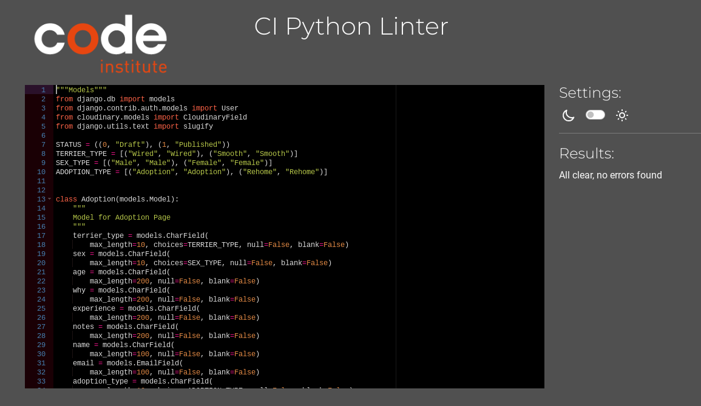
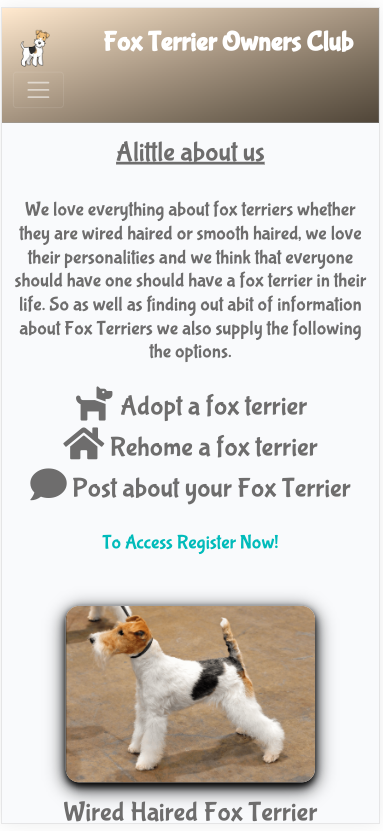
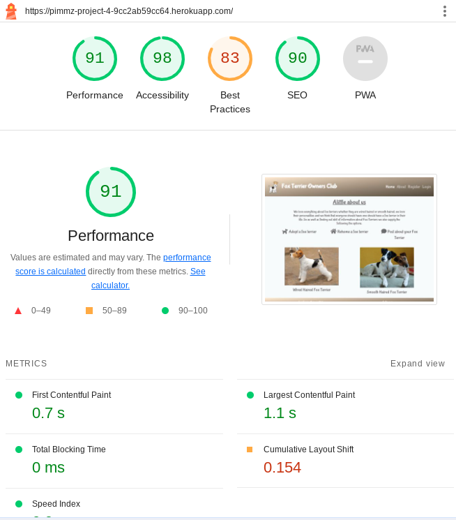
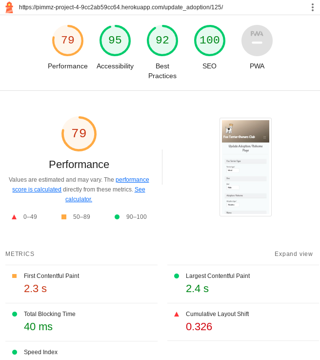
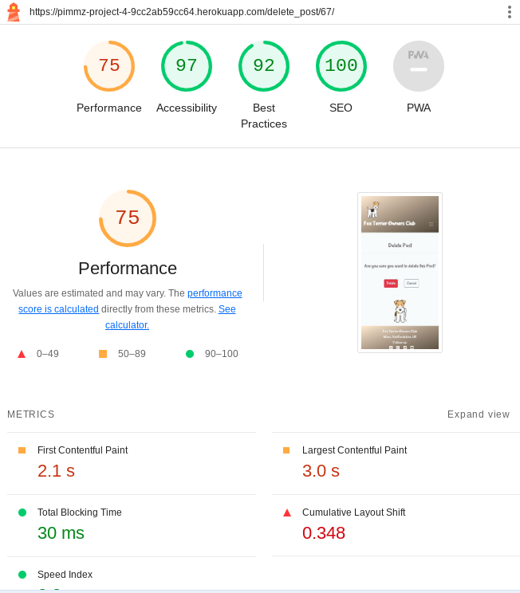
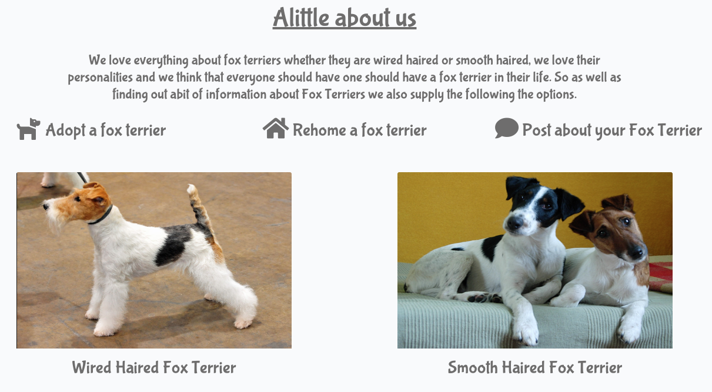
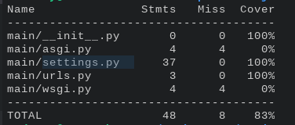

# Testing

Return back to the [README.md](README.md) file.

To ensure that The Fox Terriers Owners Club works effectively over several sites and devices, I have prepared details and screenshots for you to see the testing I have done to ensure it is very reliable.

## Code Validation

### HTML

I have used the recommended [HTML W3C Validator](https://validator.w3.org) to validate all of my HTML files. Which I have put into a tanle below so you can easily check them.

| Page | W3C URL | Screenshot | Notes |
| --- | --- | --- | --- |
| Home | [W3C](https://validator.w3.org/nu/?doc=https%3A%2F%2Fpimmz-project-4-9cc2ab59cc64.herokuapp.com%2F) |  | Pass: No Errors  |
| About | [W3C](https://validator.w3.org/nu/?doc=https%3A%2F%2Fpimmz-project-4-9cc2ab59cc64.herokuapp.com%2Fabout%2F) |  | Forbidden code point U+009d. Fixed by removing invalid syntax |
| Register | [W3C](https://validator.w3.org/nu/?doc=https%3A%2F%2Fpimmz-project-4-9cc2ab59cc64.herokuapp.com%2Faccounts%2Fsignup%2F) |  |  Pass: No Errors  |
| Login | [W3C](https://validator.w3.org/nu/?doc=https%3A%2F%2Fpimmz-project-4-9cc2ab59cc64.herokuapp.com%2Faccounts%2Flogin%2F) |  | Pass: No Errors |
| Adoption/Rehome| [W3C](https://validator.w3.org/nu/?doc=https%3A%2F%2Fpimmz-project-4-9cc2ab59cc64.herokuapp.com%2Faccounts%2Fsignup%2F%3Fnext%3D%2Fadoption%2F) |  | Pass: No Errors |
| Adoption/rehome details | [W3C](https://validator.w3.org/nu/?doc=https%3A%2F%2Fpimmz-project-4-9cc2ab59cc64.herokuapp.com%2Faccounts%2Fsignup%2F%3Fnext%3D%2Fadoption%2F29%2F) |  | Pass: No Errors |
| Update adoption/rehome details | [W3C](https://validator.w3.org/nu/?doc=https%3A%2F%2Fpimmz-project-4-9cc2ab59cc64.herokuapp.com%2Faccounts%2Fsignup%2F%3Fnext%3D%2Fupdate_adoption%2F125%2F) |  | Pass: No Errors |
| Delete adoption/rehome details | [W3C](https://validator.w3.org/nu/?doc=https%3A%2F%2Fpimmz-project-4-9cc2ab59cc64.herokuapp.com%2Faccounts%2Fsignup%2F%3Fnext%3D%2Fdelete_adoption%2F98%2F) |  | Pass: No Errors |
| No adoption Details | [W3C](https://pimmz-project-4-9cc2ab59cc64.herokuapp.com/adoption/29/) |  | Pass: No Errors |
| Post Room | [W3C](https://validator.w3.org/nu/?doc=https%3A%2F%2Fpimmz-project-4-9cc2ab59cc64.herokuapp.com%2Faccounts%2Fsignup%2F%3Fnext%3D%2Fblog.html) |  |  Pass: No Errors |

### CSS

I have used the recommended [CSS Jigsaw Validator](<https://jigsaw.w3.org/css-validator/#validate_by_uri>) to validate all of my CSS files.

| File | Jigsaw URL | Screenshot | Notes |
| --- | --- | --- | --- |
| style.css | [Jigsaw](https://jigsaw.w3.org/css-validator/validator?uri=https%3A%2F%2Fpimmz-project-4-9cc2ab59cc64.herokuapp.com%2F&profile=css3svg&usermedium=all&warning=1&vextwarning=&lang=en) |  | Pass: No Errors |

### JavaScript

I have used the recommended [JShint Validator](https://jshint.com) to validate all of my JS files.

I have used /* jshint esversion: 11, jquery: true */ at the top of the file so Jshint is allowed to recognize modern ES6 methods, such as:
`let`.

| File | Screenshot | Notes |
| --- | --- | --- |
| script.js |  | Unused variables from external file|

### Python

I have used the recommended [PEP8 CI Python Linter](https://pep8ci.herokuapp.com) to validate all of my Python files.

For lines that have been too long I have shortened everything where possible however there was one section in settings.py that couldn't be shortened due to it affecting the functionality of the code so I have used `# noqa` at the end of those lines so it will ignore linting validation.

| File | CI URL | Screenshot | Notes |
| --- | --- | --- | --- |
| admin.py | [PEP8 CI](https://pep8ci.herokuapp.com/https://raw.githubusercontent.com/Pimmz/Project-4/main/blog/admin.py) |  | Pass: No Errors  |
| forms.py | [PEP8 CI](https://pep8ci.herokuapp.com/https://raw.githubusercontent.com/Pimmz/Project-4/main/blog/forms.py) |  | Pass: No Errors |
| models.py | [PEP8 CI](https://pep8ci.herokuapp.com/https://raw.githubusercontent.com/Pimmz/Project-4/main/blog/models.py) |  | Pass: No Errors |
| urls.py | [PEP8 CI](https://pep8ci.herokuapp.com/https://raw.githubusercontent.com/Pimmz/project-4/main/blog/urls.py) |  | Pass: No Errors |
| views.py | [PEP8 CI](https://pep8ci.herokuapp.com/https://raw.githubusercontent.com/Pimmz/Project-4/main/blog/views.py) |  | Pass: No Errors |
| settings.py | [PEP8 CI](https://pep8ci.herokuapp.com/https://raw.githubusercontent.com/Pimmz/Project-4/main/main/settings.py) |  | Pass: No Errors |
| urls.py | [PEP8 CI](https://pep8ci.herokuapp.com/https://raw.githubusercontent.com/Pimmz/Project-4/main/main/urls.py) |  | Pass: No Errors |
| wsgi.py | [PEP8 CI](https://pep8ci.herokuapp.com/https://raw.githubusercontent.com/Pimmz/Project-4/main/main/wsgi.py) |  | Pass: No Errors |
| manage.py | [PEP8 CI](https://pep8ci.herokuapp.com/https://raw.githubusercontent.com/Pimmz/Project-4/main/manage.py) |  | Pass: No Errors |

## Browser Compatibility

I have tested The Fox Terriers Owners Club on four different browsers using [Browserling](https://www.browserling.com/). I used this site because you can test multiple browsers in one place for free. The first was Chrome, the second was Firefox, the third was Edge and the fourth was Opera.

- [Chrome](https://www.google.com/chrome)
- [Firefox (Developer Edition)](https://www.mozilla.org/firefox/developer)
- [Edge](https://brave.com/download)
- [Opera](https://www.opera.com/download)

I've tested my deployed project on multiple browsers to check for compatibility issues.

| Browser | Screenshot | Notes |
| --- | --- | --- |
| Chrome |  | Works as expected |
| Firefox |  | Works as expected |
| Edge |  | Works as expected |
| Opera |  | Works as expected |

## Responsiveness

I've tested my deployed project on multiple devices to check for responsiveness issues.

| Device | Screenshot | Notes |
| --- | --- | --- |
| ipad mini |  | Works as expected |
| ipad air |  | Works as expected |
| iphonese | | Works as expected |
| iphone 12 pro |  | Works as expected |
| iphone xr |  | Works as expected |
| Nest hub|  | Works as expected |
| Nest hub Max|  | Works as expected |
| Pixel 5 |  | Works as expected |
| Surface duo |  | Works as expected |
| Galaxy A51 / 71 |  | Works as expected |
| Galaxy S8 |  | Works as expected |
| Galaxy S20 Ultra |  | Works as expected |

## Lighthouse Audit

I've tested my deployed project using the Lighthouse Audit tool to check for any major issues. 

Desktop
| Page | Size | Screenshot | Notes |
| --- | --- | --- | --- |
| Home | Desktop |  | Few warnings |
| About | Desktop |  | Few warnings |
| Register | Desktop |  | Worked as expected |
| Login | Desktop |  | Worked as expected |
| Adoption/Rehome | Desktop |  | Worked as expected |
| Adoption/Rehome Detail Page | Desktop |  | Worked as expected |
| Adoption/Rehome Update Page | Desktop |  | Worked as expected |
| Adoption/Rehome Delete Page | Desktop |  | Worked as expected |
| Post Room Page | Desktop |  | Average performance due to number of images and size |
| Post Room Update Page | Desktop |  | Good overall though average accessibility |
| Post Room Delete Page | Desktop |  | Worked as expected  |
| Comment Room Page | Desktop |  | Good overall although accessibility knocked out slightly by gif |

Mobile
| Page | Size | Screenshot | Notes |
| --- | --- | --- | --- |
| Home | Mobile |  | Slow response time due to gif and images. Compressed and using cloudinary to be more effective. |
| About | Mobile |  | Average performance score due to gif and images|
| Register | Desktop |  | Average performance score due to gif. loaded to cloudinary to be more effective |
| Login | Desktop |  | Average performance score due to gif and images |
| Adoption/Rehome | Desktop |  |  Average performance score due to gif |
| Adoption/Rehome Detail Page | Desktop |  | All good except Average performance score due to large gif |
| Adoption/Rehome Update Page | Desktop |  | All good except Average performance score due to large gif. |
| Adoption/Rehome Delete Page | Desktop |  | All good except Average performance score due to large gif |
| Post Room Page | Desktop |  | Average performance due to number of images and size |
| Post Room Update Page | Desktop |  | Average performance and accessability score due to gif |
| Post Room Delete Page | Desktop |  | All good except Average performance score due to  gif |
| Comment Room Page | Desktop |  | Average performance and accessability score due to gif |

## Defensive Programming

Defensive programming was manually tested with the below user acceptance testing:

| Page | User Action | Expected Result | Pass/Fail | Comments |
| --- | --- | --- | --- | --- |
| Home Page | | | | |
| | Click on Logo Name | Redirection to Home page | Pass | |
| | Click on Home link in navbar | Redirection to Home page | Pass | |
| | Brute forcing the URL to get to the page for loggin users only |  User redirected to sign up page | Pass |  |
| About Page | | | | |
| | Click on About link in navbar | Redirection to About page | Pass | |
| | Click on Wikipedia links | Wikipedia loaded as expected | Pass | |
| | Brute forcing the URL to get to another user's profile | Redirects user back to own profile | Pass | |
| Register | | | | |
| | Click on Register link in navbar | Redirection to Register page | Pass | |
| | Enter valid email address | Field will only accept email address format | Pass | |
| | Enter valid password (twice) | Field will only accept password format | Pass | |
| | Submit without filling in all required boxes | Error message appears highlighting area | Pass | |
| Log In | | | | |
| | Click Login link in the navbar | Redirection to Login page | Pass | |
| | Enter valid username | Field will only accept a registered username | Pass | |
| | Enter valid password | Field will only accept a registered password | Pass | |
| Adoption/Rehome Page | | | | |
| | Click on Adoption link in navbar | Redirection to Adoption page | Pass | |
| | Enter first/last name | Field will accept freeform text | Pass | |
| | Enter valid email address | Field will only accept email address format | Pass | |
| | Select terrier type or sex from drop down menu | User can only choose from the two available choices| Pass | |
| | Enter message in textarea | Field will accept freeform text | Pass | |
| | No message in textareas | error message appears stating this field is required | Pass | |
| | Click the Submit button | Redirects user to the adoption detail page where they have the opportunity to update/delete or cancel which returns to the adoption page | Pass |  |
| Adoption/Rehome Detail Page | | | | |
| | Click on Update button | User will be redirected to the Update adoption page | Pass | |
| | Click on the Delete button | User will be redirected to the Delete adoption page | Pass | |
| | Click on the Cancel button | User will be redirected to the Home page | Pass | |
| | Brute forcing the URL to get to another user's profile | User will not be allowed access | Pass | Redirects user back to own profile |
| Update Adoption/Rehome Page | | | | |
| | Enter first/last name | Field will accept freeform text | Pass | |
| | Enter valid email address | Field will only accept email address format | Pass | |
| | Select terrier type or sex from drop-down menu | User can only choose from the two available choices| Pass | |
| | Enter message in textarea | Field will accept freeform text | Pass | |
| | No message in textareas | error message appears stating this field is required | Pass | |
| | Click the Submit button | Redirects user to the adoption detail page where they have the opportunity to update/delete or cancel which returns to the Update adoption page | Pass |  |
| | Click on the Cancel button | User will be redirected to the Home page  | Pass | |
| | Brute forcing the URL to get to another user's profile | User will not be allowed access | Pass | Redirects user back to own profile |
| Delete Adoption/Rehome Page | | | | |
| | Click on the Delete Button | Redirection to Adoption page | Pass | Confirms delete first|
| | Click the Delete button | Redirects user to Adoption page  | Pass |  |
| | Click on the Cancel button | User will be redirected to the Home page  | Pass | |
| Post Room Page | | | | |
| | Click on Post Room link in navbar | Redirection to Post Room page | Pass | |
| | Enter Title | Field will accept freeform text | Pass | |
| | Enter Content | Field will accept freeform text | Pass | |
| | No message in textareas | error message appears stating this field is required | Pass | |
| | Click on Choose Image button |  Choose your image you want to upload| Pass | |
| | Click on Add Your Post button  | Redirection to Post Room page with message to confirm the post was successful | Pass | |
| | Click post title  | Redirected to the comment room page | Pass | |
| | Click on Update button | User will be redirected to the Update adoption page | Pass | |
| | Click on the Delete button | User will be redirected to the Delete adoption page | Pass | |
| | Click on Update button | Only available to registered user that made the post | Pass | |
| | Click on the Delete button | Only available to registered user that made the post | Pass | |
| Update Post Page | | | | |
| | Click on the Update Button | Redirection to Update post page | Pass | |
| | Enter Title | Field will accept freeform text | Pass | |
| | Enter Content | Field will accept freeform text | Pass | |
| | Choose Image | Change your image you have uploaded| Pass | |
| | Click the Submit button | Redirects user to the comment page  | Pass |  |
| | Click on the Cancel button | User will be redirected to the Post Room page  | Pass | |
| Delete Post Page | | | | |
| | Click on the Delete Button | Redirection to Delete post page | Pass | Confirms delete first|
| | Click the Delete button | Redirects user to the Post Room page  | Pass |  |
| | Click on the Cancel button | User will be redirected to the Post Room page  | Pass | |
| Log Out | | | | |
| | Click Logout button | Redirects user to sign out page | Pass | Confirms logout first |
| | Click Confirm Logout button | Redirects user to home page | Pass | |

## User Story Testing

| User Story | Screenshot |
| --- | --- |
| EPIC User Story | User Profile |
| As a Site User I can register an account so that I can add/edit/delete my adoption plus rehoming requests and comment on the posts of other people's post. |  |
| As a Site User, I can log in or log out of my account so that I can keep my account secure. |  |
| As a Site User I can see my login status so that I know if I'm logged in or out. |  |
|EPIC User Story | User Navigation |
| As a Site User I can immediately understand the purpose of the site so that I can decide if it meets my needs.|  |
| As a Site User, I can intuitively navigate around the site so that I can find content and understand where I am on the site. |  |
| As a Site User, I can view a paginated list of posts so that I can easily select a post to view. |  |
| As a Site User, I can click on a post so that I can read the full text |  |
| As a Site User I can register an account so that I can comment, like, add an adoption and rehome request |  |
| As a Site User, I can view a list of posts so that I can select one to read |  |
|EPIC User Story | Post Management |
| As a Site User, I can update and delete posts that I have created so that I can easily make changes without having to start over. |  |
| As a Site User I can leave comments on a post so that I can be involved in the conversation |  |
| As a Site User I can view my posts so that I can see and manage all my own posts, but not be able to change other peoples. |  |
| As a Site User I can view my posts so I can find them easily in one location. |  |
| As a Site user I can like or unlike a post so that I can interact with the content |  |
| EPIC User Story | Adoption/Rehome Interaction |
| As a Site User, I can see my request so that I can find it easily at a later date. |  |
| As a Site User, I can update and delete adoption/rehome requests that I have created so that I can easily make changes if I have made a mistake. |  |
| EPIC User Story | Site Administration |
| As a Site Administrator, I can create, read, update and delete adoption, rehome requests, posts and comments so that I can manage the app content. |  |
| As a Site Administrator, I can view comments on an individual post so that I can read the conversation |  |
| As a Site Admin I can create draft posts so that I can finish writing the content later |  |

## Automated Testing

I have conducted a series of automated tests on my application.

I fully acknowledge and understand that, in a real-world scenario, an extensive set of additional tests would be more comprehensive.

### JavaScript (Jest Testing)

### Python (Unit Testing)

I have used Django's built-in unit testing framework to test the application functionality.

In order to run the tests, I ran the following command in the terminal each time:

`python3 manage.py test name-of-app`

To create the coverage report, I would then run the following commands:

`coverage run --source=name-of-app manage.py test`

`coverage report`

To see the HTML version of the reports, and find out whether some pieces of code were missing, I ran the following commands:

`coverage html`

`python3 -m http.server`

Below are the results from the various apps on my application that I've tested:

| App | File | Coverage | Screenshot |
| --- | --- | --- | --- |
| Blog | test___init__.py | 100% |  |
| Blog | test_admin.py | 92% |  |
| Blog | test_apps.py | 79% |  |
| Blog | test_forms.py | 99% |  |
| Blog | test_models.py | 87% |  |
| Blog | test_test.py | 99% |  |
| Blog | test_urls.py | 89% |  |
| Blog | test_views.py | 43% |  |
| Main | test___init__.py | 100% |  |
| Main | test_asgi.py | 0% |  |
| Main | test_settings.py   | 100% |  |
| Main | test_urls.py| 100% |  |
| Main | test_wsgi.py | 0% |  |

 |

#### Unit Test Issues

Use this section to list any known issues you ran into while writing your unit tests.
Remember to include screenshots (where possible), and a solution to the issue (if known).

This can be used for both "fixed" and "unresolved" issues.

## Bugs

- Page not found, error 404

    

  - I fixed this, by ensuring the path was correct in the url.

- Invalid cloudinary url scheme

    

  - To fix this, I corrected the url to 'cloudinary://'

- Rehome not defined

    

  - To fix this, I imported rehome in the views as I had forgotten to put it in.

- Python `E501 line too long` (90 > 79 characters)

    

  - To fix this, I split the line onto two lines ensuring it was split so it would nt cause any errors  

## Unfixed Bugs

There are no remaining bugs that I am aware of.
